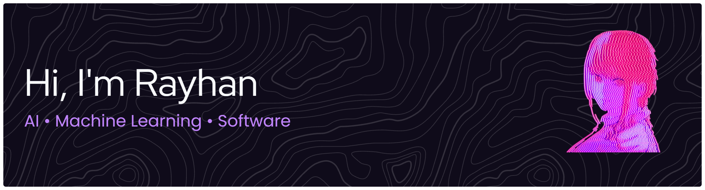

  

# Hi, I'm Rayhan 👋

**Informatics Engineering student** building toward Software Engineering & AI.

Learning by building real projects

---

## 🧑‍💻 About Me

I'm an Informatics Engineering student who learns by building. So far that's mostly small web apps in JavaScript, HTML and CSS from a coding camp. I'm now moving toward Python and machine learning fundamentals, and I'm curious about backend, APIs, automation and Discord bots.

I'm open to feedback and collaboration.

## 🎯 Currently Learning

- 🐍 Python and machine learning fundamentals
- 🤖 Building AI-powered applications
- ⚙️ Backend development and APIs
- 🧱 Software engineering fundamentals

---

## 🛠️ Tech Stack

**Languages & Web**

**Tools**

**Exploring:** Python · Machine Learning · Backend & APIs · Discord bots

---

## 🚀 Featured Projects

| Project | About | Stack |
| :-- | :-- | :-- |
| [**To-Do List Mini Project**](https://github.com/rayhanabdallah/CodingCamp-24August26-rayhanabdallah) | A to-do list app built as a coding camp mini project, with a written spec in the repo. | JavaScript, HTML, CSS |
| [**Coding Camp Projects**](https://github.com/rayhanabdallah/revou-coding-camp) | Coursework and projects from RevoU Coding Camp, including a `valorant-marketplace` project. | JavaScript |

<!-- Add a demo link once deployed, e.g. [Live demo](https://YOUR-DEMO-URL) -->
<!-- Add new projects here (Discord bot, API, ML experiment, etc.) -->

---

## 🤖 AI & Developer Tools

AI-assisted development and experimentation: I use these tools as learning aids while building, not as a replacement for understanding the code.

- **Kiro**: spec-driven workflow, as seen in my [To-Do List project](https://github.com/rayhanabdallah/CodingCamp-24August26-rayhanabdallah)
<!-- Add ONLY tools you really use, e.g.:
- **VS Code**: main editor
- **GitHub Copilot**: code suggestions
- **ChatGPT / Gemini**: explaining concepts and debugging ideas
-->

---

## 📊 GitHub Stats

  
  

---

## 🐍 Contributions

  <picture>
    <source media="(prefers-color-scheme: dark)" srcset="https://raw.githubusercontent.com/rayhanabdallah/rayhanabdallah/output/github-snake-dark.svg" />
    <source media="(prefers-color-scheme: light)" srcset="https://raw.githubusercontent.com/rayhanabdallah/rayhanabdallah/output/github-snake.svg" />
    
  </picture>

---

## 🌐 Connect With Me

<!--  -->
<!--  -->
<!--  -->

